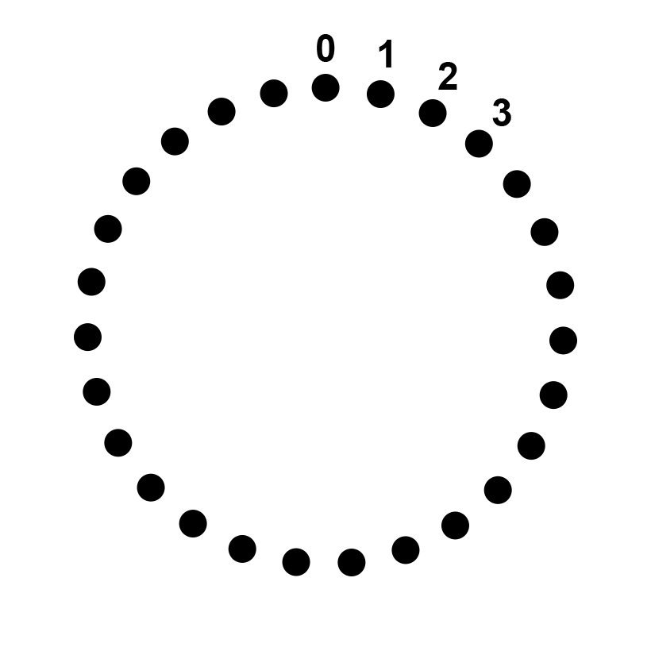
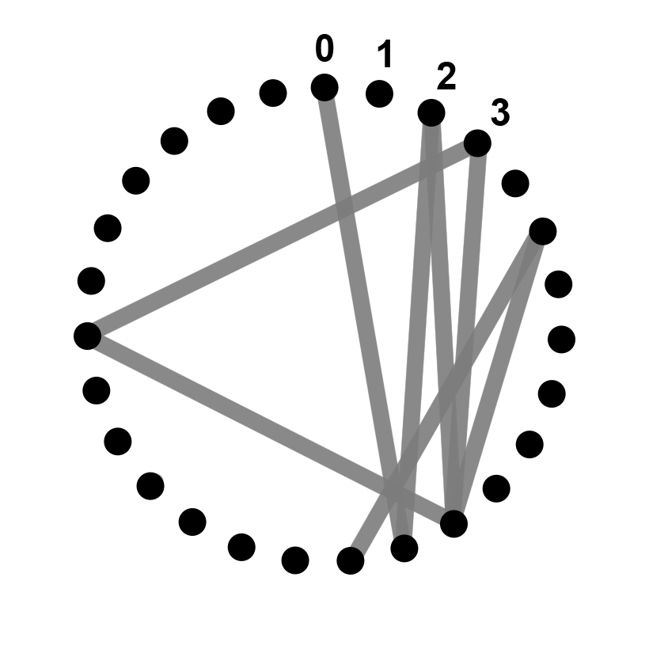
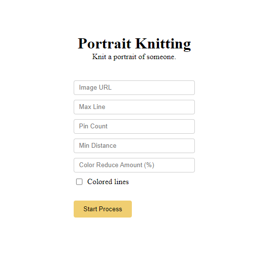

# Portrait Knitting

A simple algorithm which transforms images to knitted threads.

- **Note 1:** Whenever the process ends, you can configure thread details (thread thickness and opaque) that suits your physical threads.

- **Note 2:** Since there is no physical art uses this algorithm, you should be aware that you could get a different result from the digital result.

[Try Live](https://ilyasbilgihan.github.io/portrait-knitting/)

  
  

## Settings Panel

We have 4 settings and 1 source image url input boxes.

#### The Settings are:

- **Max Line Count** — How many vectors (straight lines) will be in our knitted thread.
- **Pin Count** — How many pins does the circular path have.
- **Min Distance(n)** — There will be no vectors (straight lines) from **ith** pin to **(i+1,2,3,...,n-1)th** pin.
- **Color Reduce Amount(percent)** — For every line we draw, we will decrease the darkness of the line's pixels from the source image

## Examples

    
Mustafa Kemal Atatürk

     
    

    
Cillian Murphy as Thomas Shelby

     
    

    
Keanu Reeves as John Wick

     
    

